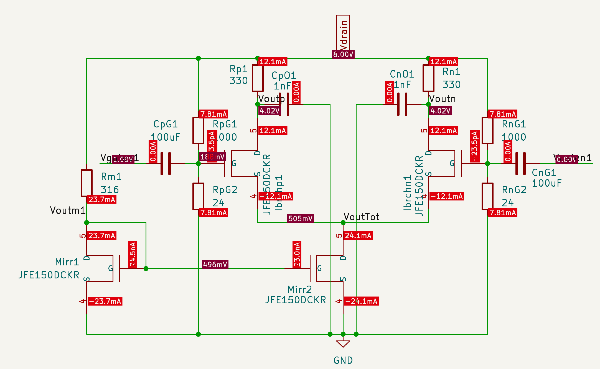
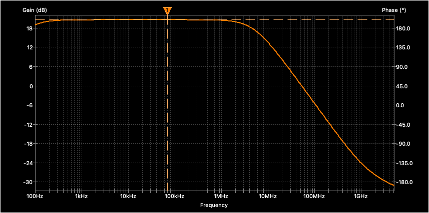
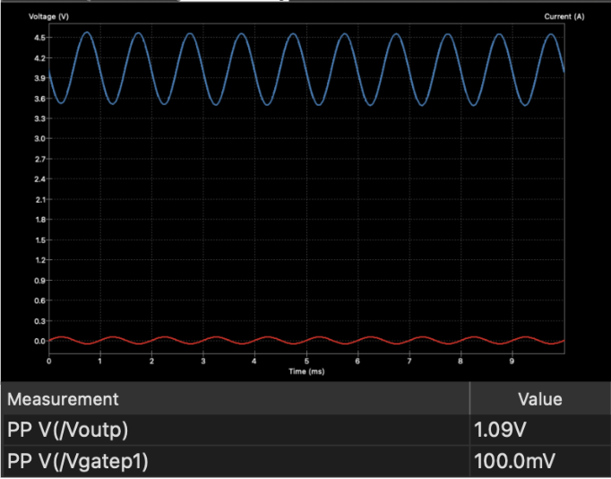
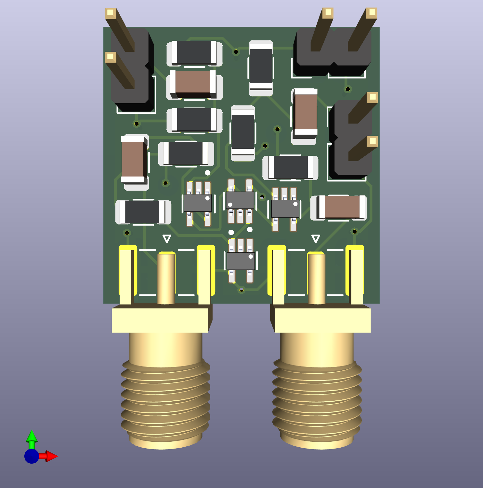

# Differential Pair Amplifier for Force Sensing Applications

---

## Overview

A fully differential JFET-based amplifier designed to condition small analog signals from pressure transducers. The amplifier takes in a weak differential signal and amplifies it for readback by a microcontroller. The design is compact enough to mount close to the sensor, minimizing noise pickup before amplification.

Typical use cases for this amplifier topology include:
- Pressure and force transducer signal conditioning
- Strain gauge bridge amplification
- Low-level differential sensor readout in embedded systems
- Any application requiring rejection of common-mode noise on a differential signal line

---

## Circuit Architecture

The amplifier is a **common-source differential pair** using two JFE150DCKR N-channel JFETs with resistive drain loads, biased by a JFET current mirror tail current source.

- **Topology:** Common-source differential pair with resistive load
- **Devices:** 2x JFE150DCKR (signal pair) + 2x JFE150DCKR (current mirror)
- **Drain resistors:** Rp1 = Rn1 = 330 Ohm
- **Tail current:** 24 mA
- **Bias point:** V_GS = 188 mV, I_D = 12.1 mA per branch
- **Supply voltage:** V_DD = 8 V
- **Load capacitance:** 1 pF

---

## DC Operating Point

| Parameter | Value |
|---|---|
| Supply voltage (V_DD) | 8 V |
| Drain voltage (Voutp / Voutn) | 4.02 V |
| Drain current per branch | 12.1 mA |
| Tail current | 24.1 mA |
| Gate bias voltage | 188 mV |
| Total DC current | ~48 mA |
| Total DC power | ~0.38 W |

The drain voltage sits at 4.02 V - midway in the 0-8 V supply range - providing symmetric output swing headroom for both positive and negative signal excursions.

---

## Simulated AC Performance

| Parameter | Simulated |
|---|---|
| Midband gain (Avd) | 20.5 dB |
| -3 dB frequency | 5.05 MHz |
| Unity gain frequency (UGF) | 51.6 MHz |
| Output Vpp (transient) | 1.09 V |
| Total DC current | ~48 mA |
| Power consumption | ~0.38 W |

### Gain

Simulated midband differential gain is **20.5 dB**. In application this means the amplifier produces roughly 10x voltage amplification of the sensor signal before it reaches the microcontroller, giving the ADC a much larger and cleaner signal to digitize than the raw transducer output.

### Bandwidth

The -3 dB frequency is **5.05 MHz** and the UGF is **51.6 MHz**.

The -3 dB frequency is the point at which gain drops 3 dB from its midband value. Signals below this frequency are amplified at full gain; signals above it begin to attenuate. For a pressure transducer reading force on a robotic arm, relevant signal frequencies are well below 1 MHz, so the 5.05 MHz -3 dB comfortably covers the application bandwidth with margin to spare.

The UGF is the frequency at which gain falls to 0 dB - the amplifier is no longer amplifying above this point. At 51.6 MHz this sets the upper bound of useful operation and also indicates the stability behavior when used in a closed-loop system.

### Transient

A 100 mVpp input sine wave at 1 kHz produces a clean **1.09 V peak-to-peak** output with no visible clipping, confirming the amplifier operates linearly at this signal level and delivers sufficient swing to drive a microcontroller ADC input.

---

## PCB Layout

- **Board size:** 20 mm x 20 mm
- **Layer stackup:** 4 layers (Top - GND - Vdrain - GND)
- **Connector type:** SMA
- Input and power connections on the top layer
- Output connections on the bottom layer
- Left/right split layout - positive non-inverting side on the left, negative inverting side on the right, current mirror in the center
- Layout mirrors the schematic topology for easier debugging and trace routing

---

## Simulation Setup

All simulations were run in ngspice via KiCAD.

**DC Operating Point (.op)**
- Static analysis to verify node voltages and branch currents

**AC Analysis**
- Command: `.ac dec 100 100 5G`
- Input AC amplitude set to 1 V differential (Vgatep1 = +1, Vgaten1 = -1)
- Differential gain plotted as `V(/Voutp) - V(/Voutn)` in dB

**Transient Analysis**
- Command: `.tran 1u 10m`
- Input: 100 mVpp sine wave at 1 kHz

---

## Files

| File | Description |
|---|---|
| `Differential_Pair_Amplifier.kicad_sch` | Main schematic |
| `Differential_Pair_Amplifier.kicad_pcb` | PCB layout |
| `Bodeplot.png` | AC gain and phase vs frequency |
| `DC_Analysis.png` | DC operating point simulation |
| `Transient_Analsyis.png` | Transient input/output waveforms |
| `UGF_-3DB.png` | Cursor measurements for UGF and -3 dB |
| `PCB.png` | 3D render of PCB |

---

## Known Limitations

- Bandwidth is limited by the resistive load topology - the dominant pole is set by R_D and the Miller capacitance of the JFE150
- A future revision with an active MOSFET load would significantly improve bandwidth while maintaining gain
